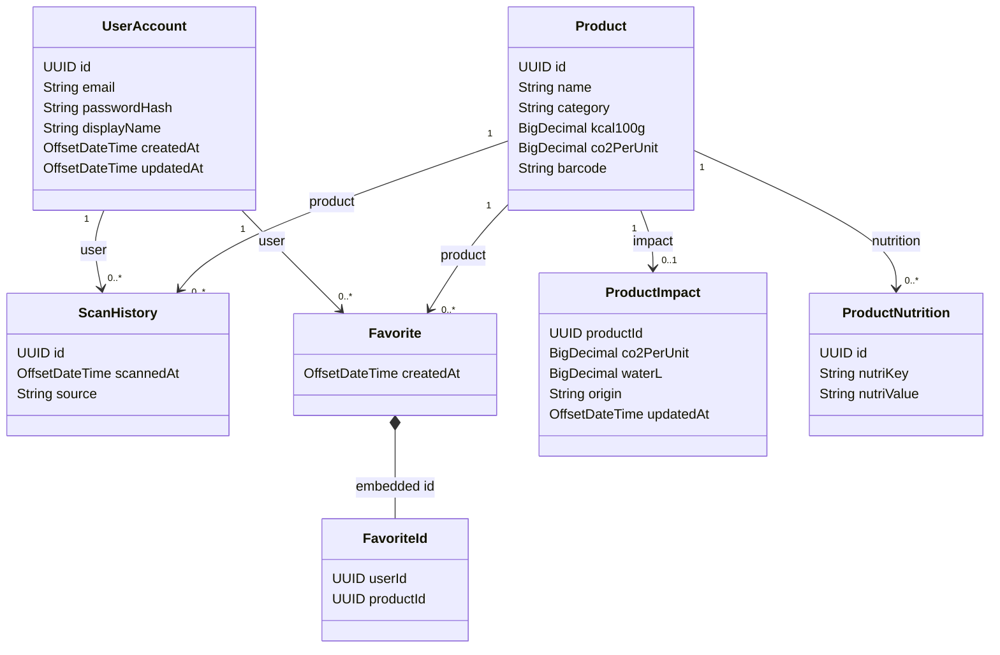

# Diagrama de Classes - EcoTrack Oracle API

## Visao geral

Este documento resume a estrutura de classes atual do projeto por camada, refletindo o estado atual do codigo.

## Diagrama de camadas (alto nivel)

```text
Clients (Mobile/Web/Postman)
        |
        v
Controllers
  - AuthController
  - MobileProductController
  - HistoryController
  - FavoriteController
  - HealthController
  - ProductController
  - UserController
  - ScanController
  - ImpactController
  - NutritionController
        |
        v
Services
  - AuthService
  - MobileProductService
  - MobileHistoryService
  - MobileFavoriteService
  - ProductService
  - UserService
  - ScanService
  - ImpactService
  - NutritionService
  - ExternalIdCodec
  - UserActivityEventPublisher
        |
        v
Repositories (Spring Data JPA)
  - ProductRepository
  - UserAccountRepository
  - ScanHistoryRepository
  - FavoriteRepository
  - ProductImpactRepository
  - ProductNutritionRepository
        |
        v
Domain (JPA)
  - Product
  - UserAccount
  - ScanHistory
  - Favorite
  - FavoriteId
  - ProductImpact
  - ProductNutrition
```

## Diagrama de dominio (entidades)



## Classes de integracao e infraestrutura

## Feign
- `InternalProductClient`
- `OpenFoodFactsClient`

## Seguranca
- `SecurityConfig`
- `JwtAuthenticationFilter`
- `JwtService`
- `CurrentUserService`
- `UserRoleResolver`
- `RoleType`
- `RestAuthenticationEntryPoint`
- `RestAccessDeniedHandler`

## Mensageria
- `RabbitMessagingConfig`
- `MessagingProperties`
- `UserActivityEventPublisher`
- `UserActivityEventListener`
- `UserActivityEvent`

## Observacoes

- Existem dois conjuntos de endpoints: mobile-friendly (sem `/api`) e legados/HATEOAS (com `/api`).
- A logica mobile usa IDs externos com prefixo (`prod-`, `user-`, `history-`, `favorite-`) via `ExternalIdCodec`.

